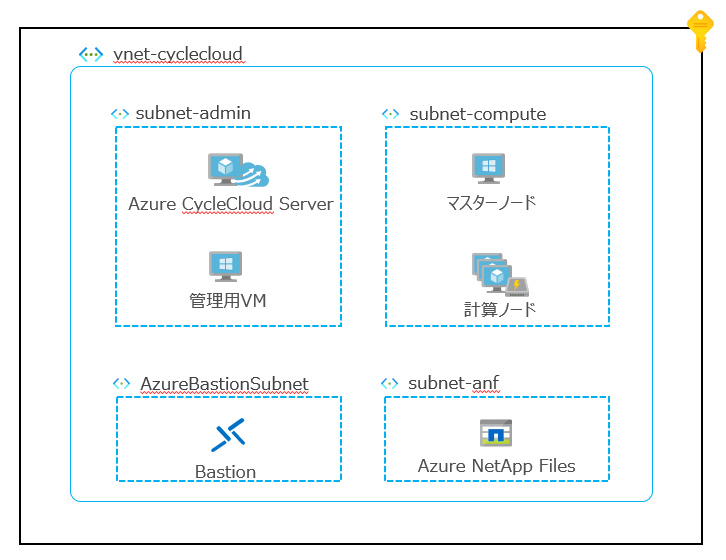
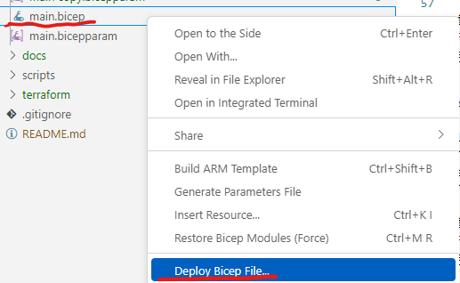
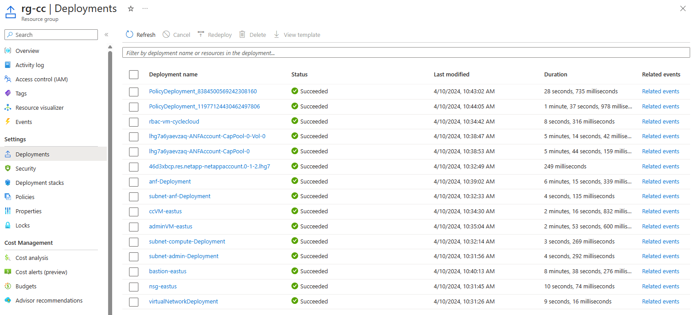

# CycleCloud 環境の構築

+ このリポジトリは、Cycle Cloud の利用イメージをつかむための実環境を構築するための手順、リソースを提供するものです。
+ Azure環境構築のためのBicepコード、クラスタセットアップのスクリプトを提供するとともに、構築の手順を紹介しています。
+ CycleCloud環境構築に必要なAzure関連のリソースのデプロイを省力化し、クラスターのセットアップからジョブ投入を体験頂ける様な流れにしています。
+ CycleCloudは8.6 （ OSS や、その他 Azure 等プラットフォームのバージョンは2024年4月時点の環境）を利用しています。

目次
- CycleCloudとは
- 構成
- 構築手順
  - Azureリソースのデプロイ
  - CycleCloudクラスターの事前設定
  - CycleCloudクラスターのデプロイ・起動・動作確認
  - クラスターの動作確認 

## CycleCloudとは


参考リンク
- [概要 - Azure CycleCloud](https://learn.microsoft.com/ja-jp/azure/cyclecloud/overview?view=cyclecloud-8)
- [Azure CycleCloud を使用してデプロイされたハイ パフォーマンス コンピューティング クラスターをカスタマイズする - Training](https://learn.microsoft.com/ja-jp/training/modules/customize-clusters-azure-cyclecloud/)
- [CycleCloud 実稼働デプロイの計画 - Azure CycleCloud](https://learn.microsoft.com/ja-jp/azure/cyclecloud/how-to/plan-prod-deployment?view=cyclecloud-8)
- [クラスター テンプレートリファレンスの概要 - Azure CycleCloud](https://learn.microsoft.com/ja-jp/azure/cyclecloud/cluster-references/cluster-template-reference?view=cyclecloud-8)

## 構成

以下の環境を構築します。



ポイント
- 1つの仮想ネットワーク内に、以下のサブネットを作成しています
  - subnet-admin
    - Azure CycleCloud Serverと、踏み台として利用する管理用VMを配置します。
  - subnet-compute
    - CycleCloudによって実際にジョブが実行される計算ノードがデプロイされます。
  - subnet-anf
    - ストレージとしてAzure Netapp Filesをデプロイするdelegatedサブネットです。
  - AzureBastionSubnet
    - 各VMへアクセスするためのBastionをデプロイするdelegatedサブネットです。
- 閉域で構成し、Bastion経由で各VMにアクセスします。
  
## 構築手順

### Azureリソースのデプロイ

main.bicepから必要なモジュールを呼び出して構築します。
パラメータは、main.bicepparamにまとめられていますので、必要に応じて編集しておきます。実行時にはこのパラメータファイルを指定します。

#### Bicepの実行

##### VSCodeからデプロイ

以下、main.bicepを選択して、「Deploy Bicep File...」を実行します。
command paletteで必要事項を指定しします。



詳細な手順は以下も参考にしてください。

参考：[Visual Studio Code を使用して Bicep ファイルをデプロイする - Azure Resource Manager](https://learn.microsoft.com/ja-jp/azure/azure-resource-manager/bicep/deploy-vscode)


##### CLIでのデプロイ

以下のコマンドを実行します。
```
az deployment sub create --location eastus --parameters 'main.bicepparam'
```

詳細な手順は以下も参考にしてください。

参考：[Azure CLI と Bicep ファイルを使用してリソースをデプロイする - Azure Resource Manager](https://learn.microsoft.com/ja-jp/azure/azure-resource-manager/bicep/deploy-cli)

#### 実行結果の確認

進行状況および結果は、Azure Portalのリソースグループの Settings → Deployments から確認可能です。




### CycleCloudクラスターの事前設定


### CycleCloudクラスターのデプロイ・起動・動作確認


### クラスターの動作確認 