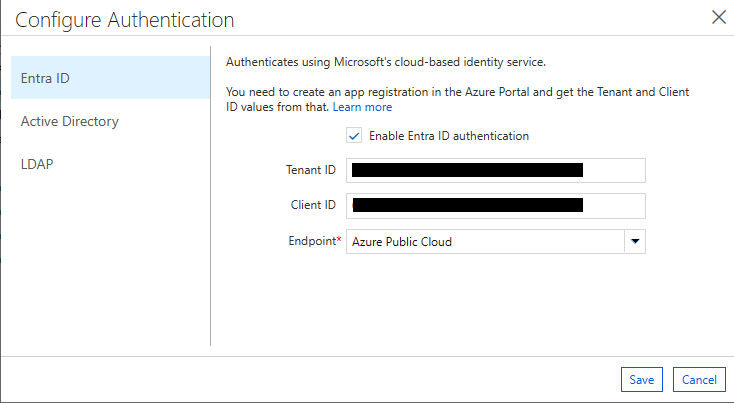
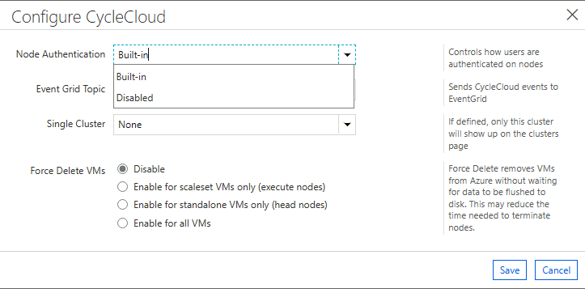
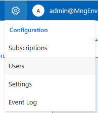
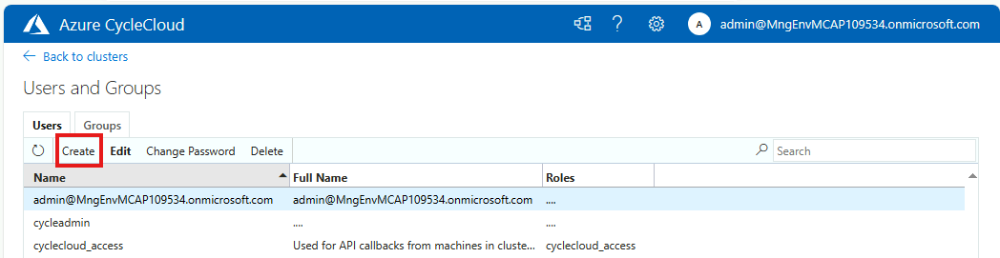
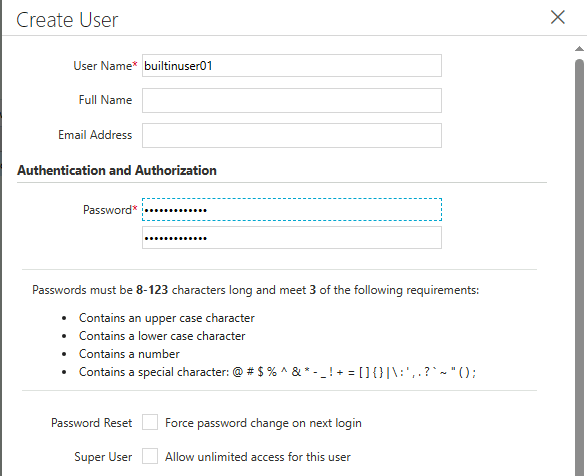
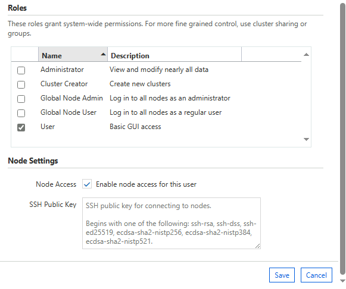
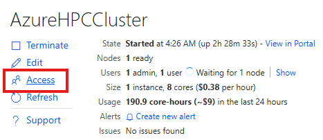

# ユーザーの認証

ここでは、以下の様な流れでCycleCloudにおけるユーザー管理について紹介します。

+ ユーザーの種類
  + CycleCloudユーザー
  + クラスター（ジョブ実行）ユーザー
+ 構成方法
  + CycleCloudユーザーの認証構成
    + Built-in
    + Active Directoryとの連携
    + EntraIDとの連携
  + クラスタージョブ実行ユーザーの認証構成
    + Built-in
    + Active Directoryとの連携

## ユーザーの種類

CycleCloudでは、以下の2種類のユーザーを区別して管理します。
CycleCloudが提供する管理UIやクラスター定義などの管理を行う`CycleCloudユーザー`と、実際のCycleCloudによって展開された計算処理ノードにログインしジョブを投入する`クラスターユーザー`という事になります。

### CycleCloud ユーザー

+ CycleCloudの管理を行う管理者ユーザー
+ CycleCloud のアプリケーション サーバーに存在
+ Web インターフェイス、コマンド ライン、およびさまざまな API へのアクセスを許可

### クラスター ユーザー

+ コンピュートノードでジョブを実行するユーザー
+ CycleCloud によって管理される各ノードのオペレーティング システムに存在

まとめると、以下の様になります。


## 構成方法

### CycleCloudユーザーの認証構成

規定では、これら2種類のユーザーはCycleCloudの **ビルトイン認証** を使用して認証されます。
その他、CycleCloudは認証を行う際のユーザーレジストリとして以下の4つの方法をサポートしています。

+ ビルトイン：CycleCloud が保持するデータベース内にユーザー/パスワードを保持し、ユーザーはこのユーザー名とパスワードを用いて認証します。
+ Entra ID（Preview）：Entra ID サービスを使用してユーザーを認証します。
+ Active Directory：Active Directory サーバーを使用してユーザーを認証します。
+ LDAP：LDAP サーバーを使用してユーザーを認証します。

#### CycleCloudユーザーの認証構成手順

以下のドキュメントを元に、**1. AD連携（実際にはAADDSとの連携）**、Previewの **2. Entra ID連携**を確認します。

+ [ユーザー管理 - Azure CycleCloud](https://learn.microsoft.com/ja-jp/azure/cyclecloud/concepts/user-management?view=cyclecloud-8)
+ [ユーザー認証 - Azure CycleCloud](https://learn.microsoft.com/ja-jp/azure/cyclecloud/how-to/user-authentication?view=cyclecloud-8)
+ [クラスター ユーザー管理 - Azure CycleCloud](https://learn.microsoft.com/ja-jp/azure/cyclecloud/how-to/user-access?view=cyclecloud-8)

##### 1. Active Directoryとの連携

このケースでは、CycleCloudユーザーの認証をActive Directoryと連携させます。


事前にActive Directory もしくは Entra ID Domain Services を構成しておきます。（構成手順は別途作成予定）

CycleCloudでは、先に紹介した認証設定画面を開き、以下を指定します。

+ URL：Active Directory のアドレスを `ldap://[_ADのipaddress_]` として指定します。
+ Default Domain：Active Directory のドメイン名を指定します。


指定後、「Test」ボタンをクリックし、AD連携のテストを行います。ADに登録されているユーザー名とパスワードを入力し、「Test」をクリックします。


> [!WARNING]
> CycleCloud 8.6 では、このテスト認証機能に不具合があるようで、正常に認証できない場合があるようです。

##### 2.Entra IDとの連携（preview）

Entra IDと直接連携してユーザー認証を行う事も可能です。（2024/04時点ではPreview）
以下の様なイメージになります。


> [!WARNING]
> こちらは、CycleCloud管理ユーザーのみにて適用可能で、クラスターユーザーには適用できません。

Entra ID との連携を行う場合、事前にAzure Portal から Entra ID のアプリケーション登録を行っておく必要があります。詳細な手順については 以下を参照し設定しておきます。（登録手順ほぼそのままの流れで設定可能です。）

参考
+ [ユーザー認証 - Azure CycleCloud](https://learn.microsoft.com/ja-jp/azure/cyclecloud/how-to/user-authentication?view=cyclecloud-8)
+ [CycleCloud で使用する Entra アプリ登録を作成する (プレビュー) - Azure CycleCloud](https://learn.microsoft.com/ja-jp/azure/cyclecloud/how-to/create-app-registration?view=cyclecloud-8#creating-the-cyclecloud-app-registration)

ポイントとしては、ロールの設定をCycleCloud側ではなく、Entra IDの「エンタープライズアプリケーション」の「ユーザーとグループ」から行う点です。

次に、CycleCloudの認証設定画面を開き、以下を指定します。

+ Tenand ID：アプリケーション登録を行った際に確認した Entra ID のテナントIDを指定します。
+ Client ID：アプリケーション登録を行った際に確認した Entra ID のクライアントIDを指定します。
+ Endpoint：Azureのデプロイ先を指定します。通常はAzure Public Cloud です。




実際に管理画面にアクセスしようとすると認証が求められます。Entra ID上のユーザー名とパスワードを入力し、認証を行います。ログインに成功すると以下の様に表示されます。


### クラスタージョブ実行ユーザーの認証

ここからは、デプロイされたクラスターノードにログインし、ジョブを投入するユーザーの認証構成について説明します。まずは前提として、ノード上に生成されるユーザーについて説明します。

#### クラスターノード上に生成されるユーザーについて

##### VMに規定で生成される管理用のcyclecloudユーザー

CycleCloudによって生成されるコンピュートノードには、規定でVMエージェントにより生成される`cyclecloud`ユーザーが存在します。このユーザーの SSH 秘密キーは、CycleCloud サーバーの /opt/cycle_server/.ssh/cyclecloud.pem に配置されていますので、この秘密キーを使用してユーザーはコンピュートノードにログイン可能です。しかしながら、このユーザー管理ユーザーという位置づけですので、一般ユーザーとしての利用は想定されていません。

そこで必要になるのが、ジョブを投入したりする一般ユーザーの管理になります。

##### 一般ユーザーの管理方法

実際にログインしてジョブを投入するOSの一般ユーザーとしては、以下の管理方法があります。

+ builtin
    
  この場合のクラスター実行ユーザーは、CycleCloud上に作成したユーザーが、クラスター側にも作成されます。

  


+ サードパーティーのユーザー管理システム（ADなど）

  この場合、クラスター実行ユーザーは、サードパーティーのユーザー管理システム（ADなど）に登録されたユーザーで認証されます。各ノードの/etc/passwdや/etc/groupには変更は加えられません。
  各ユーザーのホームディレクトリは、初回ログイン時に作成されるよう構成します。

  

これらは排他的に設定する必要はなく、built-in でCycleCloud上で定義したユーザーを利用しつつ、特定のユーザーにおいてはAD連携を行って認証するといった構成も可能です。

#### 構成手順

それぞれの方法でのユーザーの管理構成手順を説明します。

##### Built-in

###### 構成手順

設定から、以下のCycleCloud 構成画面を開きます。


展開すると以下の様な画面が開きます。ここで、`Built-in` あるいは `Disabled` を選択可能ですが、`Built-in` を選択します。




ユーザーを追加するには、設定メニューから、`Users` を選択します。



`Users and Groups`画面が開きます。ここで、`Create` をクリックし、ユーザーを追加します。



必要事項を入力します。





作成したユーザーを、クラスター定義に反映させるために、クラスター初期画面の`Access`をクリックします。



###### 確認

実際にCycleCloudマスタノードにログインして今回追加した`builinuser01`ユーザーが作成されているかどうか確認します。

```bash
[cycleadmin@ip-0A00030A ~]$ id builtinuser01
uid=20013(builtinuser01) gid=20013(builtinuser01) groups=20013(builtinuser01)
```

無事作成されているのがわかります。

初期状態だと、グループはユーザー名と同等のものが作成されますが、グループを追加する場合は、`Users and Groups`画面から`Create`をクリックし、グループを追加します。


##### クラスタージョブ実行ユーザーのAD連携

ここまではbuilt-inでのユーザー管理を行いましたが、別途計算ノードにおいても Active Directory との連携を行う事も可能です。（Cloud-initなどに構成の仕込みが必要になります。）
以下の資料を参考に、Active Directory との連携を行います。

参考
+ [クラスター ユーザー管理 - Azure CycleCloud](https://learn.microsoft.com/ja-jp/azure/cyclecloud/how-to/user-access?view=cyclecloud-8)
+ 一般的なLinux VMのドキュメントとして、[Linux VMをAD参加させる手順](https://learn.microsoft.com/ja-jp/entra/identity/domain-services/join-rhel-linux-vm?tabs=rhel) が紹介されていますが、ここでは、cloud-initを利用して、VMの起動時にAD参加を行う方法を紹介します。

###### ADの設定

まずは、ADの構築・設定を行います。ここでは、Entra ID Domain Services を利用します。

参考
+ https://learn.microsoft.com/ja-jp/entra/identity/domain-services/tutorial-create-instance

以下の様にEntra ID DSを 構成しています。


###### cloud-initの設定

cloud-init の設定を行います。

重要なポイントは、AD情報を以下の部分に反映する事です。

```bash
    #!/bin/bash
    AD_SERVER=cc.com            ← Entra ID DSのドメイン名をそのまま指定する
    AD_SERVER_IP=10.0.5.4       ← Entra ID DSのIPアドレスを指定する
    ADMIN_DOMAIN=$AD_SERVER
    ADMIN_NAME=XXXXXXXX         ← Entra IDに追加・同期済みユーザー名
    ADMIN_PASSWORD=‘XXXXXXXX’   ← Entra IDに追加・同期済みユーザーのパスワード
```

cloud-initに追加する全体の内容は以下の通りです。

```
#cloud-config
packages:
 - sssd
 - realmd
 - oddjob
 - oddjob-mkhomedir
 - adcli
 - samba-common
 - samba-common-tools
 - krb5-workstation
 - openldap-clients
 - policycoreutils-python-utils
write_files:
 - path: /root/adjoin.sh
   permissions: '0700'
   owner: root:root
   content: |
    #!/bin/bash
    AD_SERVER=cc.com
    AD_SERVER_IP=10.0.5.4
    ADMIN_DOMAIN=$AD_SERVER
    ADMIN_NAME=XXXXXXXX
    ADMIN_PASSWORD=‘XXXXXXXX’

    echo "nameserver ${AD_SERVER}" >> /etc/resolv.conf
    echo "${AD_SERVER_IP} ${AD_SERVER}" >> /etc/hosts

    sed -i 's/PasswordAuthentication no/PasswordAuthentication yes/g' /etc/ssh/sshd_config
    
    # Check automatically create home directory config
    grep pam_mkhomedir.so /etc/pam.d/sshd
    if [ $? -eq 1 ]; then
      echo "session required pam_mkhomedir.so skel=/etc/skel/ umask=0022" >> /etc/pam.d/sshd
    fi
    
    realm list | grep active-directory
    if [ $? -eq 1 ]; then
    logger -s "Node $(hostname) is not domain joined"
    exit 1


    cat <<EOF >/etc/ssh/ssh_config
    Host *
    StrictHostKeyChecking no
    UserKnownHostsFile /dev/null
    EOF

    delay=15
    n=1
    max_retry=3

    while true; do
      logger -s "Domain join on $ADMIN_DOMAIN"
      echo $ADMIN_PASSWORD| realm join -U $ADMIN_NAME $ADMIN_DOMAIN

      if [ ! -f "/etc/sssd/sssd.conf" ]; then
        if [[ $n -le $max_retry ]]; then
          logger -s "Failed to domain join the server - Attempt $n/$max_retry:"
          sleep $delay
          ((n++))
        else
          logger -s "Failed to domain join the server after $n attempts."
          exit 1
        fi
      else
        logger -s "Successfully joined domain $ADMIN_DOMAIN"
        realm list
        break
      fi
    done

    sed -i 's@use_fully_qualified_names.*@use_fully_qualified_names = False@' /etc/sssd/sssd.conf
    sed -i 's@ldap_id_mapping.*@ldap_id_mapping = True@' /etc/sssd/sssd.conf
    sed -i 's@fallback_homedir.*@fallback_homedir = /shared/home/%u@' /etc/sssd/sssd.conf

    systemctl restart sssd
    systemctl restart sshd

    # Check if we are domain joined
    realm list | grep active-directory
    if [ $? -eq 1 ]; then
    logger -s "Node $(hostname) is not domain joined"
    exit 1
    fi
    
runcmd:
 - sh /root/adjoin.sh 2>&1>/root/logs.txt
```
設定を行うためには、クラスターメニューから、`Edit` をクリックし、`Cloud-init` を選択し、上記の設定を記述します。


「Cloud-init configuration」に上記の設定を記述します。


###### 確認

実際にノードにログインし、ADユーザーでログインできるか確認します。

まず、EntraID側には以下のユーザーを追加しています。


マスターノードで、ADユーザーでログインできるか確認します。

まず、管理ユーザーでマスターノードにログインし、ユーザーの情報を確認してみます。

```bash
[cycleadmin@ip-0A00030A ~]$ id aduser01
uid=1753401122(aduser01) gid=1753400513(domain users) groups=1753400513(domain users)
[cycleadmin@ip-0A00030A ~]$ id aduser02
uid=1753401124(aduser02) gid=1753400513(domain users) groups=1753400513(domain users)
[cycleadmin@ip-0A00030A ~]$ id ccadmin
uid=1753401119(ccadmin) gid=1753400513(domain users) groups=1753400513(domain users),1753401103(aad dc administrators),1753400520(group policy creator owners),1753401101(dnsadmins),1753400572(denied rodc password replication group)
```

以下の様に実際にログインできるようになっています。

```
[cycleadmin@vm-cyclecloud ~]$ ssh aduser01@10.0.3.10
aduser01@10.0.3.10's password:
Activate the web console with: systemctl enable --now cockpit.socket

Last login: Thu Apr 25 03:10:02 2024 from 10.0.1.5
```
