# **目次**
- [**目次**](#目次)
  - [クラスター、ノード操作の前に・・・・](#クラスターノード操作の前に)
    - [Azure VMの停止状態](#azure-vmの停止状態)
- [クラスターの管理・操作](#クラスターの管理操作)
  - [クラスターの起動](#クラスターの起動)
    - [CycleCloud Web UIを利用したクラスターの起動](#cyclecloud-web-uiを利用したクラスターの起動)
    - [CycleCloud CLIを利用したクラスターの起動](#cyclecloud-cliを利用したクラスターの起動)
    - [対応する Azure VMの状態確認](#対応する-azure-vmの状態確認)
  - [クラスターの停止](#クラスターの停止)
    - [CycleCloud Web UIを利用したクラスターの停止](#cyclecloud-web-uiを利用したクラスターの停止)
    - [CycleCloud CLIを利用したクラスターの停止](#cyclecloud-cliを利用したクラスターの停止)
    - [対応する Azure VM の状態確認](#対応する-azure-vm-の状態確認)
  - [ノードの停止](#ノードの停止)
    - [ノードの停止 その1 (Deallocate)](#ノードの停止-その1-deallocate)
      - [CycleCloud Web UIを利用したノードの停止 その1 (Deallocate)](#cyclecloud-web-uiを利用したノードの停止-その1-deallocate)
      - [CycleCloud CLIを利用したノードの停止 その1 (Deallocate)](#cyclecloud-cliを利用したノードの停止-その1-deallocate)
      - [対応する Azure VMの状態確認](#対応する-azure-vmの状態確認-1)
    - [ノードの停止 その2 (Terminate)](#ノードの停止-その2-terminate)
      - [CycleCloud Web UIを利用したノードの停止 その2 (Terminate)](#cyclecloud-web-uiを利用したノードの停止-その2-terminate)
      - [CycleCloud CLIを利用したノードの停止 その2 (Terminate)](#cyclecloud-cliを利用したノードの停止-その2-terminate)
      - [対応する Azure VMの状態確認](#対応する-azure-vmの状態確認-2)
  - [ノードの起動](#ノードの起動)
    - [CycleCloud Web UIを利用したノードの起動](#cyclecloud-web-uiを利用したノードの起動)
    - [CycleCloud CLIを利用したノードの起動](#cyclecloud-cliを利用したノードの起動)
  - [ノードの停止方法まとめ](#ノードの停止方法まとめ)

## クラスター、ノード操作の前に・・・・

### Azure VMの停止状態

CycleCloudの各ノードの実体はAzure VMです。よって、CycleCloudの各操作が、実態としてのAzure VMにどのように反映されるかを理解しておく必要があります。
Azure VMの停止状態には以下の様な状態があります。

- 停止済み / Stopped 
- 停止済み（割り当て解除）/ Deallocated 

「停止済み」の状態では、Azure VMのリソース（CPU、メモリ、ディスク）は保持されたままで、課金が発生します。一方、「停止済み（割り当て解除）」の状態では、Azure VMのリソースが解放され、課金が発生しません。
「停止済み」の状態は、ゲストOSの内部でシャットダウンを行ったりした場合に遷移します。一方、「停止済み（割り当て解除）」の状態は、AzureポータルやAzure CLIを利用してVMを停止した場合に遷移します。

参考：
[States and billing status of Azure Virtual Machines](https://learn.microsoft.com/ja-jp/azure/virtual-machines/states-billing)

# クラスターの管理・操作

## クラスターの起動

CycleCloudクラスターの起動は、CycleCloud Web UIやCycleCloud CLIを利用して行います。クラスターの起動には、以下の手順が必要です。

### CycleCloud Web UIを利用したクラスターの起動

1. CycleCloud Web UIにログイン

    CycleCloudサーバーのIPアドレスにWebブラウザでアクセスし、CycleCloud Web UIにログインします。

2. クラスターの起動

    管理画面から、Startボタンをクリックしてクラスターを起動します。

    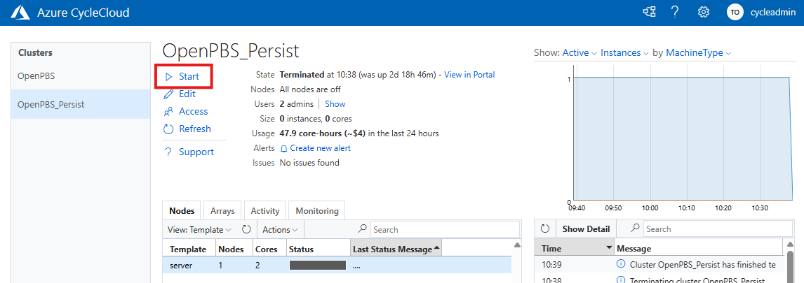

### CycleCloud CLIを利用したクラスターの起動

CycleCloud CLIを利用して、クラスターを起動します。

```bash
$ cyclecloud  start_cluster <クラスター名>
```

実行例
```bash 
[cycleadmin@vm-cyclecloud ~]$ cyclecloud start_cluster OpenPBS_Persist
Starting cluster OpenPBS_Persist....
---------------------------------------
OpenPBS_Persist : allocation -> started
---------------------------------------
Resource group: rg-cyclecloud
Cluster nodes:
    server: Terminated -- --
Total nodes: 1
```

`cyclecloud show_cluste` コマンドで起動状態を確認します。

    実行例
    ```
    [cycleadmin@vm-cyclecloud ~]$ cyclecloud show_cluster OpenPBS_Persist
    -------------------------
    OpenPBS_Persist : started
    -------------------------
    Resource group: rg-cyclecloud
    Cluster nodes:
        server: Started ip-0A0A0304 10.10.3.4 server-MZQTCMZVMZSTCLJUGE4WGLJUGA
    Total nodes: 1
    ```

### 対応する Azure VMの状態確認

Azure Portalから確認すると、templateで指定したVMサイズに応じたVMが起動していることが確認できます。

- Azure Portalからの確認
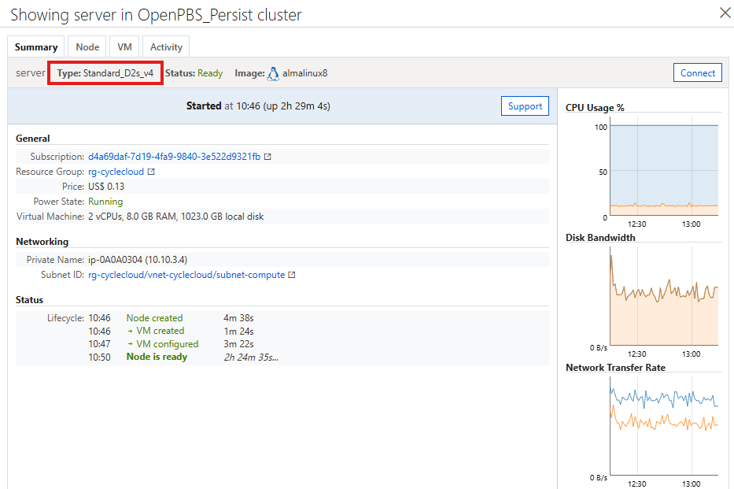

- Azure Portalからの確認
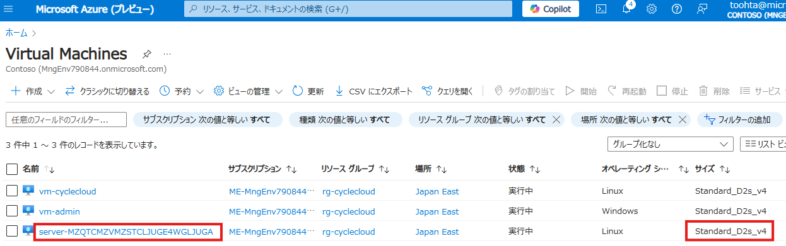


参考：
- https://learn.microsoft.com/ja-jp/azure/cyclecloud/cli?view=cyclecloud-8#cyclecloud-start_cluster
- https://learn.microsoft.com/ja-jp/azure/cyclecloud/cli?view=cyclecloud-8#cyclecloud-show_cluster

## クラスターの停止

### CycleCloud Web UIを利用したクラスターの停止

1. CycleCloud Web UIにログイン
 
    CycleCloudサーバーのIPアドレスにWebブラウザでアクセスし、CycleCloud Web UIにログインします。

2. クラスターの停止
   
   管理画面から、「Terminate」 ボタンをクリックしてクラスターを停止します。

    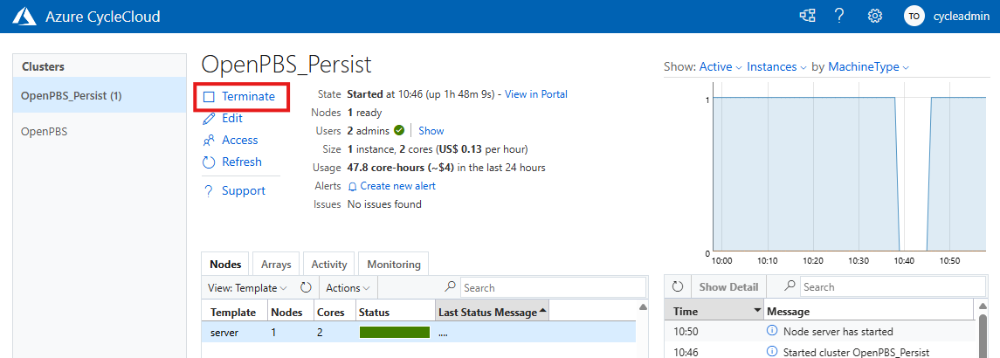


### CycleCloud CLIを利用したクラスターの停止

CycleCloud CLIを利用して、クラスターを停止します。

```bash
$ cyclecloud  terminate_cluster <クラスター名>
```

実行例
```bash 
[cycleadmin@vm-cyclecloud ~]$ cyclecloud terminate_cluster OpenPBS_Persist
Terminating cluster OpenPBS_Persist....
-------------------------------------------
OpenPBS_Persist : termination -> terminated
-------------------------------------------
Resource group: rg-cyclecloud
Cluster nodes:
    server: TerminatePreparation ip-0A0A0304 10.10.3.4 server-MZQTCMZVMZSTCLJUGE4WGLJUGA
Total nodes: 1
```

`cyclecloud show_cluste` コマンドで起動状態を確認します。

```
[cycleadmin@vm-cyclecloud ~]$ cyclecloud show_cluster OpenPBS_Persist
----------------------------
OpenPBS_Persist : terminated
----------------------------
Resource group: rg-cyclecloud
Cluster nodes:
    server: Terminated -- --
Total nodes: 1
```
### 対応する Azure VM の状態確認

クラスターの停止をした場合、Azure VM リソース自体が削除された状態になります。

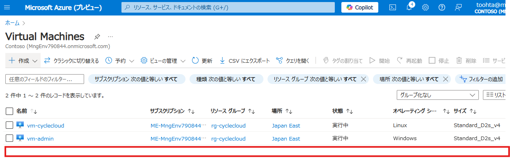

Azure VMのリソースは削除されますが、クラスターテンプレートの定義で Persist ＝ True としているボリュームについては、Managed Diskとして保管されます。次回起動時に自動的にアタッチされます。

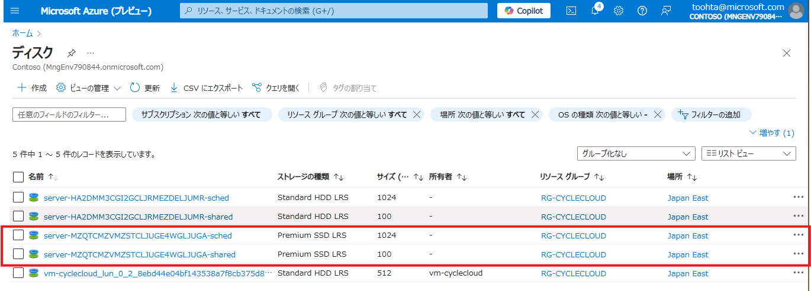

## ノードの停止

ノードを停止する場合、ノードの停止方法には以下の2つがあります。
1. Deallocate
2. Terminate

Azureとしてのリソースの扱われ方に違いがありますので、Azure VMの状態をどのようにしたいのか、によって使い分ける必要があります。


### ノードの停止 その1 (Deallocate)

#### CycleCloud Web UIを利用したノードの停止 その1 (Deallocate)

1. CycleCloud Web UIにログイン
 
    CycleCloudサーバーのIPアドレスにWebブラウザでアクセスし、CycleCloud Web UIにログインします。

2. ノードの停止
   
    「Actions」から、「ShutDown」を選択します。

    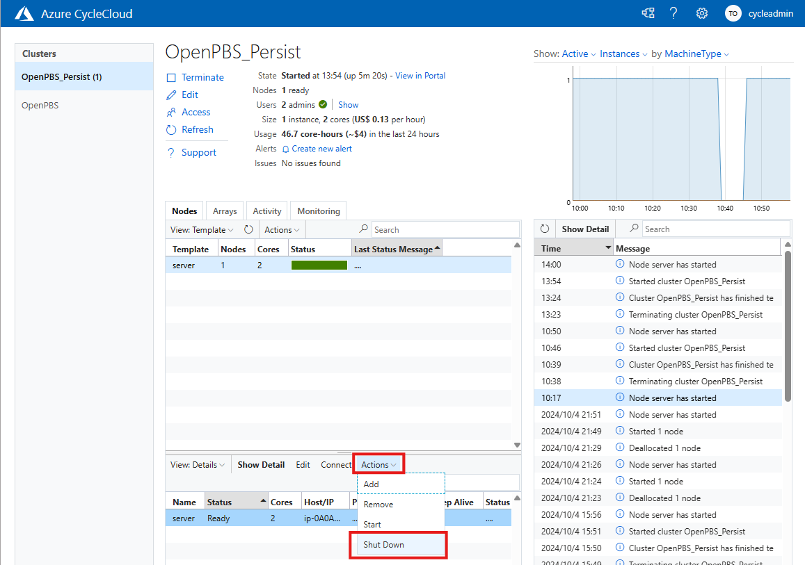

    「Deallocate the VM but keep the boot disk」を選択して、ノードを停止します。

    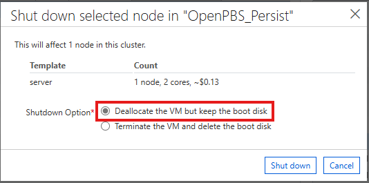

#### CycleCloud CLIを利用したノードの停止 その1 (Deallocate)

以下のコマンドでノードを停止（Deallocate）します。

```bash
$ cyclecloud deallocate_node <クラスター名> <ノード名>
```

実行例
```bash
[cycleadmin@vm-cyclecloud ~]$ cyclecloud deallocate_node OpenPBS_Persist server
Deallocating node server in cluster OpenPBS_Persist....
Deallocated node server
-------------------------
OpenPBS_Persist : started
-------------------------
Resource group: rg-cyclecloud
Cluster nodes:
    server: Deallocated ip-0A0A0304 10.10.3.4 server-MZQTCMZVMZSTCLJUGE4WGLJUGA
Total nodes: 1
```

`cyclecloud show_node`コマンドでノードの状況を確認します。

```bash
[cycleadmin@vm-cyclecloud ~]$ cyclecloud show_node server --cluster=OpenPBS_Persist
Credentials = "CycleCloud"
Name = "server"
ClusterName = "OpenPBS_Persist"
Instance = [AdType="Cloud.Instance";InstanceId="569693ac441e953f015833c6e4571a03";MachineType="Standard_D2s_v4";PrivateHostName="ip-0A0A0304";PrivateIp="10.10.3.4";StartTime=`2024-10-07T04:55:03.371+00:00`;Tags=[ClusterId="OpenPBS_Persist(cycleadmin@cyclecloud-tohhta:swkdmd3c)";ClusterName="OpenPBS_Persist";CycleCloudCluster="/sites/swkdmd3c/clusters/OpenPBS_Persist";CycleOwner="cycleadmin@cyclecloud-tohhta:swkdmd3c";LaunchTime="2024-10-07T04:55:02.566+00:00";Name="server"]]
State = "Deallocated"
TargetState = "Deallocated"
```

#### 対応する Azure VMの状態確認

この場合、Azure VMは停止済み（割り当て解除）の状態になります。よって、boot disk、data disk 共に保持されます。リソースの割り当ては解除されていますので、VMに対する課金は発生しません。

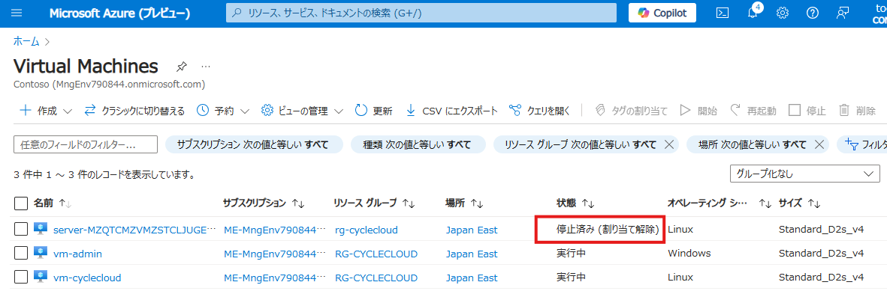

### ノードの停止 その2 (Terminate)

#### CycleCloud Web UIを利用したノードの停止 その2 (Terminate)

1. CycleCloud Web UIにログイン
 
    CycleCloudサーバーのIPアドレスにWebブラウザでアクセスし、CycleCloud Web UIにログインします。

2. ノードの停止
   
    「Actions」から、「ShutDown」を選択します。

    

    「Terminate the VM and delete the boot disk」を選択して、ノードを停止します。

    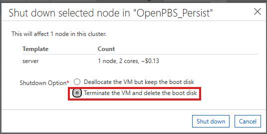

#### CycleCloud CLIを利用したノードの停止 その2 (Terminate)

以下のコマンドでノードを停止（Terminate）します。

```bash
$ cyclecloud terminate_node <クラスター名> <ノード名>
```

実行例
```bash
[cycleadmin@vm-cyclecloud ~]$ cyclecloud terminate_node OpenPBS_Persist server
Terminating node server in cluster OpenPBS_Persist....
-------------------------
OpenPBS_Persist : started
-------------------------
Resource group: rg-cyclecloud
Cluster nodes:
    server: Termination ip-0A0A0304 10.10.3.4 server-MZQTCMZVMZSTCLJUGE4WGLJUGA
Total nodes: 1
```

`cyclecloud show_node`コマンドでノードの状況を確認します。

```bash
[cycleadmin@vm-cyclecloud ~]$ cyclecloud show_node server --cluster=OpenPBS_Persist
Credentials = "CycleCloud"
Name = "server"
ClusterName = "OpenPBS_Persist"
Instance = []
State = "Terminated"
TargetState = "Terminated"
```
#### 対応する Azure VMの状態確認

この場合、Azure VMが削除された状態になります。


## ノードの起動

個別に停止したノードは、ノード単位で起動する事が出来ます。ノード起動時にはクラスターが起動している必要がありますので、クラスターが停止している場合は、クラスターを起動してからノードを起動してください。

### CycleCloud Web UIを利用したノードの起動

1. CycleCloud Web UIにログイン
 
    CycleCloudサーバーのIPアドレスにWebブラウザでアクセスし、CycleCloud Web UIにログインします。    

2. ノードの起動

    「Actions」から、「Start」を選択します。

    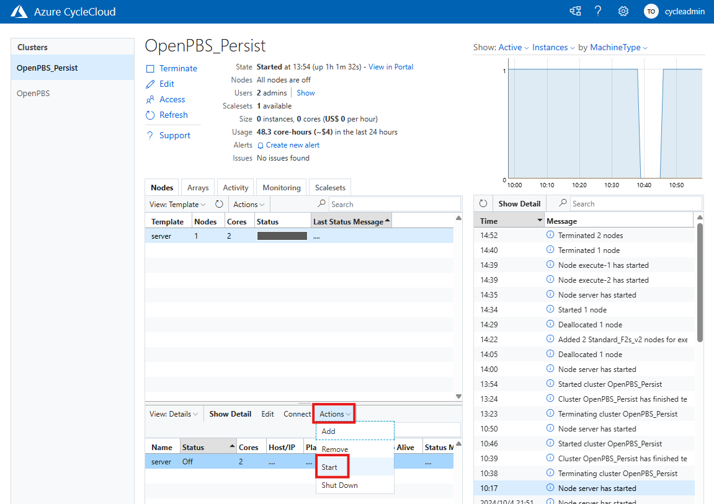
    
### CycleCloud CLIを利用したノードの起動

以下のコマンドでノードを起動します。

```bash
$ cyclecloud start_node <クラスター名> <ノード名>
```


実行例
```bash
[cycleadmin@vm-cyclecloud ~]$ cyclecloud start_node OpenPBS_Persist server
Starting node server in cluster OpenPBS_Persist...
-------------------------
OpenPBS_Persist : started
-------------------------
Resource group: rg-cyclecloud
Cluster nodes:
    server: Validation -- --
Total nodes: 1
```

`cyclecloud show_node`コマンドでノードの状況を確認します。

```bash
[cycleadmin@vm-cyclecloud ~]$ cyclecloud show_nodes server --cluster=OpenPBS_Persist
Credentials = "CycleCloud"
Name = "server"
ClusterName = "OpenPBS_Persist"
Instance = [AdType="Cloud.Instance";InstanceId="569693ac441e953f015833c6e4571a03";MachineType="Standard_D2s_v4";PrivateHostName="ip-0A0A0304";PrivateIp="10.10.3.4";StartTime=`2024-10-07T06:03:05.338+00:00`;Tags=[ClusterId="OpenPBS_Persist(cycleadmin@cyclecloud-tohhta:swkdmd3c)";ClusterName="OpenPBS_Persist";CycleCloudCluster="/sites/swkdmd3c/clusters/OpenPBS_Persist";CycleOwner="cycleadmin@cyclecloud-tohhta:swkdmd3c";LaunchTime="2024-10-07T06:03:04.574+00:00";Name="server"]]
State = "Started"
TargetState = "Started"
```


## ノードの停止方法まとめ

|停止方法|ノード VMの状態|boot disk|data disk|
|---|---|---|---|
|クラスターの停止（cluster terminate）|存在しない （VMリソースは削除される）|削除される|volume定義依存（persist ＝ true で保管される）|
ノードの終了（terminate）|存在しない （VMリソースは削除される）|削除される|volume定義依存（persist ＝ true で保管される）|
|ノードの割り当て解除（deallocate）|停止（割り当て解除）|保管される|保管される|


