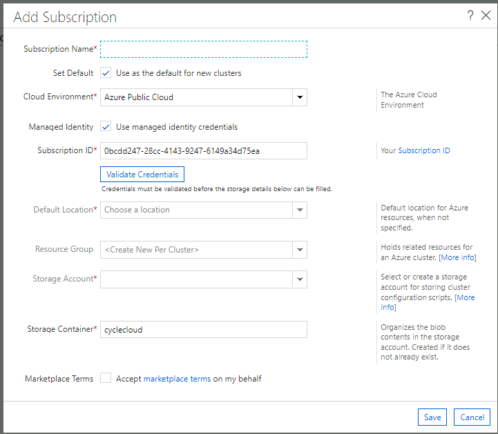
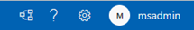
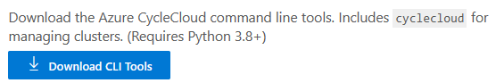

# CycleCloudサーバーの設定

## Azure CycleCloud管理ポータルへのアクセス

一連のAzureリソースがデプロイされた後は、CycleCloudサーバーの設定を行います。
Azure CycleCloud サーバーは管理ポータルを提供していますので、Bation経由で管理VMにログインし、管理VMからブラウザでAzure CycleCloud管理ポータルにアクセスします。

Azure CycleCloud管理ポータルにアクセスすると、以下のような画面が表示されます。


Azure CycleCloud管理ポータルにアクセスすると、以下のような画面が表示されます。
ここでの入力項目は以下の通りです。

項目 | 説明 | 入力値の例
---------|----------|---------
 Site Name | サイト名 を作成します。 任意の名前をここで使用できます。 |Test CycleCloud Site


項目    | 設定内容 | 説明 | 入力値の例
---------|----------|---------|---------
User UD | 管理者アカウント| CycleCloud管理ポータルの管理者アカウント名を設定します。| cycleadmin
Name    | 管理者の名前 | CycleCloud管理ポータルの管理者の名前を設定します。| Satya Nadella
Password |パスワード | CycleCloud管理者ポータルにログインするときのパスワードを設定します。| 任意のパスワード
Confirm | パスワードの確認 | パスワードの確認をします。| 任意のパスワード
SSH Public Key | SSH公開鍵 | 展開されるクラスターなどに接続する際に利用するSSH公開鍵を設定します。 | 以下参照

ssh-keygen等のコマンドを使用してSSH公開鍵を生成します。或いは、既存のSSH公開鍵を使用することもできます。
ここでは、CycleCloudサーバー上でSSH公開鍵を生成し、その内容をコピーしてAzure CycleCloud管理ポータルに貼り付けます。

```text
[cycleadmin@vm-cyclecloud .ssh]$ ssh-keygen 
Generating public/private rsa key pair.
Enter file in which to save the key (/home/cycleadmin/.ssh/id_rsa): 
Enter passphrase (empty for no passphrase): 
Enter same passphrase again: 
Your identification has been saved in /home/cycleadmin/.ssh/id_rsa.
Your public key has been saved in /home/cycleadmin/.ssh/id_rsa.pub.
The key fingerprint is:
SHA256:12zOR8jv0UR+DNYx96YqeJgRpsjDOksbTXgJGputcPk cycleadmin@vm-cyclecloud
The key's randomart image is:
+---[RSA 3072]----+
|               o.|
|               .=|
|. .     o     o =|
| * * o o . + o B |
|= = O . S . * o =|
|.o * .   * + + o.|
|. = E   + o + + .|
| . =     . . o . |
|  o           .  |
+----[SHA256]-----+
```

上記の場合は、/home/cycleadmin/.ssh/id_rsa.pub として公開鍵が生成されています。


## サブスクリプションの設定

次に、利用するサブスクリプションの設定を行います。



以下の項目を設定します。

設定項目 | 設定内容 | 説明
-----|------|---
Subscription Name | azure | ここで設定するサブスクリプションの名称を設定します。
Set Default | チェックを入れる | この設定をデフォルトとして利用する場合はチェックを入れます。
Cloud Environment | Azure Public Cloud | 利用するAzureクラウド環境を選択します。
Managed Identity | チェックを入れる | マネージドIDを利用する場合はチェックを入れます。
Subscription ID | サブスクリプションID | サブスクリプションIDが自動的に入力されています。

ここまで、設定したら「Validate Credentials」を押します。「Test succeeded」と表示されれば、設定が正しいことが確認できます。


引き続き以下の設定を行います。

設定項目 | 設定内容 | 説明
-----|------|---
Default Location | East US | デフォルトのリージョンを設定します。
Resource Group | rg-cc | このCycleCloudサーバから展開されるクラスターのリソースグループを設定します。既存のリソースグループを選択することもできますが、<Create New Per Cluster>を選択すると展開されるクラスターごとにリソースグループが作成されます。
Storage Account | ccsatoohta001 | クラスターの設定などを格納するためのストレージアカウントを設定します。既存のストレージアカウントを設定するか、新規で作成します。入力したストレージアカウント名が既存のストレージアカウントにない場合、新規に作成されます。新規作成する場合、ストレージアカウント名はユニークである必要がありますので、注意が必要です。
Storage Container | cyclecloud | ストレージアカウント内に格納するためのコンテナを作ります。
Marketplace Terms | チェックを入れる | Marketplace TermsをAcceptする

## CycleCloud CLIの設定
次に、CycleCloud CLIの設定を行います。

Azure CycleCloudのコマンドラインツールAzure CycleCloud CLIの設定をします。Azure CycleCloud CLIはCycleCloudサーバにインストールされています。また、CycleCloud管理ポータルの右上のクエスチョンマークを押し、Azure CycleCloud CLIをダウンロードして任意のマシンへインストールすることができます。
 

 
ここでは、CycleCloudサーバにインストールされているAzure CycleCloud CLIの設定をしていきます。
まず、CycleCloudサーバへSSHで接続します。Azure PortalでCycleCloudサーバをデプロイした際に設定したユーザ名/パスワードを使用します。



以下のコマンドでCycleCloud CLIのバージョンを確認することができます。(CycleCloudサーバには、すでにCycleCloud CLIがインストール済みです。)

```bash
[cycleadmin@vm-cyclecloud ~]$ cyclecloud --version
CycleCloud 8.6.1-3248
```

まず、”cyclecloud initialize”コマンドで初期化します。以下の設定をします。
設定項目 | 設定内容 | 説明
-----|------|---
CycleServer URL | https://vm-cyclecloud |仮想ネットワーク内からのアクセスのため、https://vm-cyclecloud を指定します。
CycleServer username | 管理者ユーザ名 | デプロイ時に使用したvm-cycleadminの管理者ユーザ名を指定します。
CycleServer password | 管理者ユーザのパスワード |デプロイ時に使用したvm-cycleadminの管理者ユーザのパスワードを指定します。

```bash
cyclecloud initialize
```

実行例

```bash
[cycleadmin@vm-cyclecloud ~]$ cyclecloud initialize
CycleServer URL: [http://localhost] https://vm-cyclecloud
Detected untrusted certificate.  Allow?: [yes] yes
CycleServer username: [cycleadmin]
CycleServer password:

Generating CycleServer key...
Initial account already exists, skipping initial account creation.
CycleCloud configuration stored in /home/cycleadmin/.cycle/config.ini
```

次に、以下のコマンドでロッカー(CyclecCloudの設定などを保存するためのストレージアカウント)が表示できるかを確認します。

```bash
 cyclecloud locker list
 ```
 
実行例

```bash
[cycleadmin@vm-cyclecloud ~]$ cyclecloud locker list
azure-storage (az://ccsatoohta001/cyclecloud)
```
