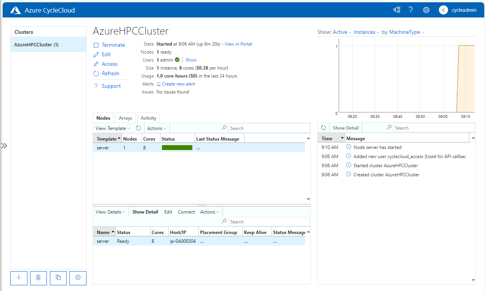

# CycleCloudクラスターのデプロイ・起動・動作確認

新しいクラスターは、管理ポータルから、あるいはクラスター定義テンプレートを編集し、インポートすることで行います。
作成手順について詳細は、[CycleCloudのドキュメント](https://learn.microsoft.com/ja-jp/azure/cyclecloud/how-to/create-cluster?view=cyclecloud-8)を参照してください。

ここでは、既存のクラスターテンプレートをカスタマイズして、新しいクラスターを作成します。
提供されているテンプレートは [ドキュメント](https://learn.microsoft.com/ja-jp/azure/cyclecloud/download-cluster-templates?view=cyclecloud-8)にリストがあります。

[OpenPBS](https://github.com/Azure/cyclecloud-pbspro)を利用して構成する流れを示します。
このGithub内のコンテンツは [プロジェクト ](https://learn.microsoft.com/ja-jp/azure/cyclecloud/how-to/projects?view=cyclecloud-8#create-a-new-project)として構成されています。

## 作業の流れ

### OpenPBS用カスタムテンプレートの用意

1. テンプレートのダウンロード
   - ベースとなるテンプレートは、[OpenPBS](https://github.com/Azure/cyclecloud-pbspro)のGitリポジトリからダウンロード可能です。
   - このリポジトリをクローンしてローカルで直接参照できるようにします。
1. テンプレートの編集
   - クローンしたリポジトリ内のプロジェクトに含まれるテンプレートをコピーし、編集します。
   - テンプレートファイルの書き方については、[こちら](https://learn.microsoft.com/ja-jp/azure/cyclecloud/how-to/cluster-templates?view=cyclecloud-8&source=recommendations)を参照してください。
1. OpenPBSパッケージのダウンロード
   - [Gitリポジトリ](https://github.com/Azure/cyclecloud-pbspro/releases/download/2.0.21/cyclecloud-pbspro-2.0.21.tar.gz)からパッケージファイルを取得します

上記の実行をスクリプトにまとめています。以下の手順に従って、クラスターをデプロイします。

```bash
wget https://raw.githubusercontent.com/0ht/cyclecloud/main/scripts/samplecluster-setup.sh
chmod +x samplecluster-setup.sh
./samplecluster-setup.sh
```
実行例
```bash
[cycleadmin@vm-cyclecloud ~]$ wget https://raw.githubusercontent.com/0ht/cyclecloud/main/scripts/samplecluster-setup.sh
--2024-04-15 02:40:19--  https://raw.githubusercontent.com/0ht/cyclecloud/main/scripts/samplecluster-setup.sh
Resolving raw.githubusercontent.com (raw.githubusercontent.com)... 185.199.110.133, 185.199.111.133, 185.199.108.133, ...
Connecting to raw.githubusercontent.com (raw.githubusercontent.com)|185.199.110.133|:443... connected.
HTTP request sent, awaiting response... 200 OK
Length: 2042 (2.0K) [text/plain]
Saving to: ‘samplecluster-setup.sh’

samplecluster-setup.sh        100%[=================================================>]   1.99K  --.-KB/s    in 0s

2024-04-15 02:40:19 (19.9 MB/s) - ‘samplecluster-setup.sh’ saved [2042/2042]

[cycleadmin@vm-cyclecloud ~]$ chmod +x samplecluster-setup.sh
[cycleadmin@vm-cyclecloud ~]$ ./samplecluster-setup.sh
Installing git...
Last metadata expiration check: 0:01:57 ago on Mon 15 Apr 2024 02:38:42 AM UTC.
：
```

### プロジェクトのアップロード

カスタマイズしたOpenPBSプロジェクトをアップロードします。

```bash
cyclecloud project upload azure-storage
```

実行例
```bash
[cycleadmin@vm-cyclecloud cyclecloud-pbspro]$ cyclecloud project upload azure-storage
INFO: Any empty folders will not be processed, because source and/or destination doesn't have full folder support
：中略
Final Job Status: Completed
```

### テンプレートのインポート

次のコマンドを実行して、カスタマイズしたテンプレートをCycleCloudサーバへインポートします。

```bash
cyclecloud import_template -f openpbs_hpc.txt
```

実行例

```bash
[cycleadmin@vm-cyclecloud templates]$ pwd
/home/cycleadmin/cyclecloud_projects/cyclecloud-pbspro/templates
[cycleadmin@vm-cyclecloud templates]$
[cycleadmin@vm-cyclecloud templates]$ cyclecloud import_template -f openpbs_hpc.txt
Importing default template in openpbs_hpc.txt....
------------------------
OpenPBS_HPC : *template*
------------------------
Resource group:
Cluster nodes:
    server: Off -- --
Total nodes: 1
```

実行後、管理ポートあるを確認してみると、以下赤枠の通りクラスターが追加されているされていることが確認できます。


### クラスターの設定

Azure CycelCloud管理ポータルでクラスターの設定をし、デプロイします。
デプロイしたいクラスターのアイコンを押して開きます。ここでは、先の手順でインポートしたOpenPBS_HPCを選択します。クリック後、以下の画面が表示されますので必要事項を入力していきます。

#### クラスター名の設定


#### 必須事項の設定（Required Settings）

##### Virtual Machines

設定項目 | 設定内容 | 説明
-----|------|---
Region | East US | 展開するリージョンを指定します。
Server VM Type | Standard_D8as_v4 | ログイン・ジョブスケジューラノードのVMサイズを選択します。
Execute VM Type | Standard_F2s_v2 | デフォルトの計算ノードのVMサイズを選択します。

##### Auto-Scaling

設定項目 | 設定内容 | 説明
-----|------|---
Autoscale | チェックをいれる | オートスケールを有効にする場合はチェックを入れます。
Cron Method | Cron | 変更しない
Max Cores | 100 | 同時に起動する最大コア数を指定します。
Low Priority | チェックを入れる | スポットVMを利用する場合はチェックを入れます。チェックをしない場合は従量課金になります。ここでは、カスタマイズによってVMサイズによって選択できるようになっています。

##### Networking

設定項目 | 設定内容 | 説明
-----|------|---
SubnetID | rg-cyclecloud: vnet-cyclecloud-subnet-compute [10.0.3.0/24] | クラスターを展開するサブネットを指定します。computeサブネットを選択します。


#### Network Atacched Stroage の設定

##### Scheduler Mount

設定項目 | 設定内容 | 説明
-----|------|---
External Scheduler | チェックしない | 外部のスケジューラを利用する場合はチェックを入れます。Serverノードが提供するジョブスケジューラを利用する場合はチェックを入れません。

##### Default NFS Share

設定項目 | 設定内容 | 説明
-----|------|---
NFS Type | Builtin | ホームディレクトリなどを含めた/sharedディレクトリをServerノードにマウントされたManaged Diskを利用する場合はBuiltinを選択、外部のNFSサーバを利用する場合はExternal NFSを選択します。
Size (GB) | 100 | Serverノードの/sharedディレクトリにマウントされたManaged Diskのサイズを設定します。

##### Additional NFS Mount

設定項目 | 設定内容 | 説明
-----|------|---
Add NFS mount | チェックを入れる | 追加のNFSサーバをマウントする場合はチェックを入れます。
NFS IP Address | NFSサーバのIPアドレス | NFSサーバのIPアドレスを設定します。
NFS Mount Point | /mnt/anf | クラスター上のマウントポイントを指定します。
NFS Export Path | NFSサーバ上のExportパス | NFSサーバ上のExportパスを指定します。
NFS Mount Options | NFSのマウントオプション | NFSのマウントオプションを設定します。

Azure NetApp Filesのボリュームをマウントする場合は、Azure PortalでAzure NetApp Filesのボリュームを開き、左側の「ストレージサービス」の「マウントに関する指示」を押して表示します。ここに記載されている情報をもとに設定します。


#### Advanced Settings

「Advanced Settings」では、サブスクリプション、各VMで利用するOSイメージ、Cluster-init、ネットワークの設定を行います。以下の設定をします。

##### Azure Settings

設定項目 | 設定内容 | 説明
-----|------|---
Credentials | azure – Default credentials | 利用する認証情報を選択します。

##### Software

設定項目 | 設定内容 | 説明
-----|------|---
Scheduler OS | Alma Linux 8 | スケジューラノードのOSを選択します。
Compute OS | Alma Linux 8  | 計算ノードのOSを選択します。
HBv2 OS | Alma Linux 8  | 計算ノードのOSを選択します。
HBv3 OS | Alma Linux 8  | 計算ノードのOSを選択します。
HC OS | Alma Linux 8  | 計算ノードのOSを選択します。
PBS Version | OpenPBS v20, el8-only | ジョブスケジューラPBSのバージョンを設定します。RHEL8系のOSに対してはOpenPBS v20またはv22、RHEL7系のOSはPBSPro v18をサポートしています。
Server Cluster-init |  | Serverノードに対するCluster-initを設定します。
Execute Cluster-init |  | 計算ノードに対するCluster-initを設定します。

##### Node Health Checks

設定項目 | 設定内容 | 説明
-----|------|---
Enable NHC tests | チェックを入れない（対応ししていないVMがあるため（ex. HC44rs）） | スタートアップ時にノードヘルスチェックを実行する


##### Advanced Networking

設定項目 | 設定内容 | 説明
-----|------|---
Return Proxy | チェックを外す | CycleCloudサーバへSSHトンネリングを利用して接続する場合はチェックを入れます。
Public Head Node | チェックを外す | インターネット経由でヘッドノード(Serverノード)へアクセスする場合はチェックを入れます。
Public Execute | チェックを外す | インターネット経由で計算ノードへアクセスする場合はチェックを入れます。


#### Security

「Security」では、セキュリティに関する項目を各VM(node)やVMSS(nodearray)毎、または」すべてのVMやVMSSに対して行います。


#### Cloud-init

「Cloud-init」では、各VM(node)やVMSS(nodearray)毎のCloud-initの設定を行います。
CycleCloud 8.6でAlmaLinux8を選択した場合、起動時にエラーになってしまう現象があります。その場合は、Cloud-initですべてのノードに対して下記の設定をすることにより回避できます。

```bash
#!/bin/bash
rpm --import https://repo.almalinux.org/almalinux/RPM-GPG-KEY-AlmaLinux
```


### クラスターの起動

クラスターの設定が完了したら、「Save」を押すと、停止した状態のクラスターが作られます。下記の画面の「Start」を押すと、Serverノード(マスターノード兼ジョブスケジューラーノード)が起動し始めます。


Serverノードが起動すると「Status」が「Ready」になり、緑になります。



#### 計算ノードの確認

カスタムテンプレートで追加した計算のノードをAzure CycleCloud管理ポータルで確認します。
デプロイしたクラスターを開き「Arrays」のタブをクリックします。下記のように、追加で登録した計算ノード(HB120rs_v2, HB120rs_v3, HC44rs)が表示されていることを確認します。


#### クラスターの動作確認

##### マスターノードへログイン

「server」をクリックすると下に、「server」の詳細が出てきます。


「server」をクリックすると下に、「server」の詳細が出てきます。


管理用にデプロイしたVMから、表示されているコマンドで接続します。

```bash
[cycleadmin@vm-cyclecloud templates]$ ssh cycleadmin@10.0.3.4
The authenticity of host '10.0.3.4 (10.0.3.4)' can't be established.
ECDSA key fingerprint is SHA256:+JIlwUb5/RhTdCLzfFvHTX6fY1zG0h16WlVujLSsKbM.
Are you sure you want to continue connecting (yes/no/[fingerprint])? yes
Warning: Permanently added '10.0.3.4' (ECDSA) to the list of known hosts.
Activate the web console with: systemctl enable --now cockpit.socket

[cycleadmin@ip-0A000304 ~]$
```

##### ディスクの確認

df -hコマンドでマウントされているディスクを確認します。下記の通り、Azure NetApp Filesのボリューム/mnt/anfおよび/mnt/swがマウントされていることが確認できます。

```bash
[cycleadmin@ip-0A000304 ~]$ df -h
Filesystem                                   Size  Used Avail Use% Mounted on
devtmpfs                                      16G     0   16G   0% /dev
tmpfs                                         16G   16K   16G   1% /dev/shm
tmpfs                                         16G   25M   16G   1% /run
tmpfs                                         16G     0   16G   0% /sys/fs/cgroup
/dev/sdc2                                     59G   27G   33G  45% /
/dev/sdc1                                    994M  209M  786M  21% /boot
/dev/sdc15                                   495M  5.9M  489M   2% /boot/efi
/dev/sdd1                                     63G  156K   60G   1% /mnt
/dev/mapper/vg_cyclecloud_builtinsched-lv0   1.0T  7.2G 1017G   1% /sched
/dev/mapper/vg_cyclecloud_builtinshared-lv0  100G  747M  100G   1% /shared
10.0.2.4:vol01                               100G  256K  100G   1% /data
tmpfs                                        3.2G     0  3.2G   0% /run/user/20001
```
