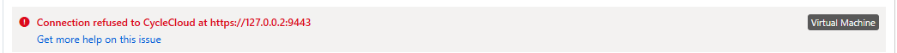

# トラブルシューティング

何か問題が発生した際には、以下のドキュメントが参考になります。

[エラーメッセージ](https://learn.microsoft.com/ja-jp/azure/cyclecloud/error_messages?view=cyclecloud-8)

その他、以下のような問題が発生することがあります。

## 現象

### ノードの起動に失敗する。ログには以下のようなエラーが出力される。
  

#### 原因
Compute NodeからCycleCloudサーバーへの接続時に何故か127.0.0.2を参照しようとしているため、接続に失敗している。

#### 対策
/opt/cycle_server/config/cycle_server.properties
を編集し、
webServerHostname に CycleCloudサーバーのホスト名を明示的に指定します。

```
[cycleadmin@vm-cyclecloud ~]$ sudo cat /opt/cycle_server/config/cycle_server.properties | grep Host
webServerHostname=vm-cyclecloud
``` 
/opt/cycle_server/cycle_server restart
してリスタート

その後、クラスターのTerminate → Start で再起動します。

#### 参考
[CycleServer Configuration](https://learn.microsoft.com/en-us/azure/cyclecloud/cycleserver-configuration-reference?view=cyclecloud-8)


### クラスターの起動に失敗する。

クラスターの起動に失敗し、ログには以下のようなエラーが出力される。

`pogo.exceptions.FrameworkError: 'az://.../blobs' is not a directory`

#### 原因
Locker用の Storage Accountで 階層型名前空間が有効になっているのが原因です。

#### 対策
階層型名前空間が無効化されたストレージアカウントを指定し直します。

#### 参考
 [一般的な問題: ステージング リソース](https://learn.microsoft.com/ja-jp/azure/cyclecloud/common-issues/staging_resources?view=cyclecloud-8)

### jetpack convergeでエラーが発生する

#### 現象

```bash
[cyclecloud@ip-0A0A0304 logs]$ sudo /opt/cycle/jetpack/bin/jetpack converge
Error: An unknown error occurred, please see jetpack.log for details.
```

以下のエラーがjetpack.logに出力される。

```bash
2024-10-04 13:03:40,298 INFO     Getting node configuration from /clusterlink/userdata/569693ac441e953f015833c6e4571a03
2024-10-04 13:03:40,405 INFO     Getting node configuration from /clusterlink/userdata/569693ac441e953f015833c6e4571a03
2024-10-04 13:03:41,157 ERROR    Software configuration failed: Failed to find project pbspro in locker at cache/projects/pbspro/2.0.23/manifest.json

2024-10-04 13:03:41,157 ERROR    Recommendation: Check that you have uploaded the project and correctly referenced it in your template
2024-10-04 13:03:41,191 ERROR    Traceback (most recent call last):
  File "/opt/cycle/jetpack/system/embedded/lib/python3.8/site-packages/jetpack/cluster_init/__init__.py", line 87, in _load_from_manifest
    self._download(src, dst, verify_source=True)
  File "/opt/cycle/jetpack/system/embedded/lib/python3.8/site-packages/jetpack/cluster_init/__init__.py", line 121, in _download
    raise SourceNotFound("The source file %s cannot be verified!" % url)
jetpack.cluster_init.SourceNotFound: The source file https://cclockertoohta01.blob.core.windows.net/cyclecloud/cache/projects/pbspro/2.0.23/manifest.json?sv=2024-08-04&sig=M5dK7%2BhYaUbsGJ14BT/RNvy5TwMOMzOqT5SvN3SHkl8%3D&se=2024-10-04T07%3A52%3A50Z&spr=https&sp=racwdl&sr=c cannot be verified!

During handling of the above exception, another exception occurred:

Traceback (most recent call last):
  File "/opt/cycle/jetpack/system/embedded/lib/python3.8/site-packages/jetpack/cli.py", line 215, in converge_command
    converge.execute(debug=debug, no_sync=no_sync, mode=mode)
  File "/opt/cycle/jetpack/system/embedded/lib/python3.8/site-packages/jetpack/converge/__init__.py", line 343, in execute
    raise e
  File "/opt/cycle/jetpack/system/embedded/lib/python3.8/site-packages/jetpack/converge/__init__.py", line 243, in execute
    config = _update_runlist(config)
  File "/opt/cycle/jetpack/system/embedded/lib/python3.8/site-packages/jetpack/converge/__init__.py", line 127, in _update_runlist
    for spec in jetpack.cluster_init.get_specs():
  File "/opt/cycle/jetpack/system/embedded/lib/python3.8/site-packages/jetpack/cluster_init/__init__.py", line 310, in get_specs
    specs = [ClusterInitSpec(spec, config=config, load_from_manifest=True) for spec in specs if spec.get('project', '').lower() != "cyclecloud"]
  File "/opt/cycle/jetpack/system/embedded/lib/python3.8/site-packages/jetpack/cluster_init/__init__.py", line 310, in <listcomp>
    specs = [ClusterInitSpec(spec, config=config, load_from_manifest=True) for spec in specs if spec.get('project', '').lower() != "cyclecloud"]
  File "/opt/cycle/jetpack/system/embedded/lib/python3.8/site-packages/jetpack/cluster_init/__init__.py", line 64, in __init__
    self._load_from_manifest()
  File "/opt/cycle/jetpack/system/embedded/lib/python3.8/site-packages/jetpack/cluster_init/__init__.py", line 90, in _load_from_manifest
    raise jetpack.util.UserError("Project download failed",
jetpack.util.UserError: Project download failed
```

#### 原因

踏査中